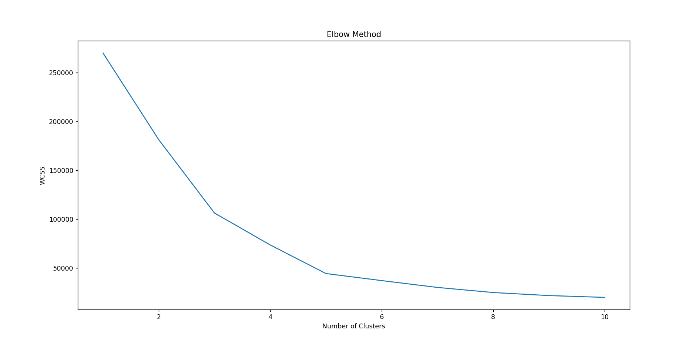
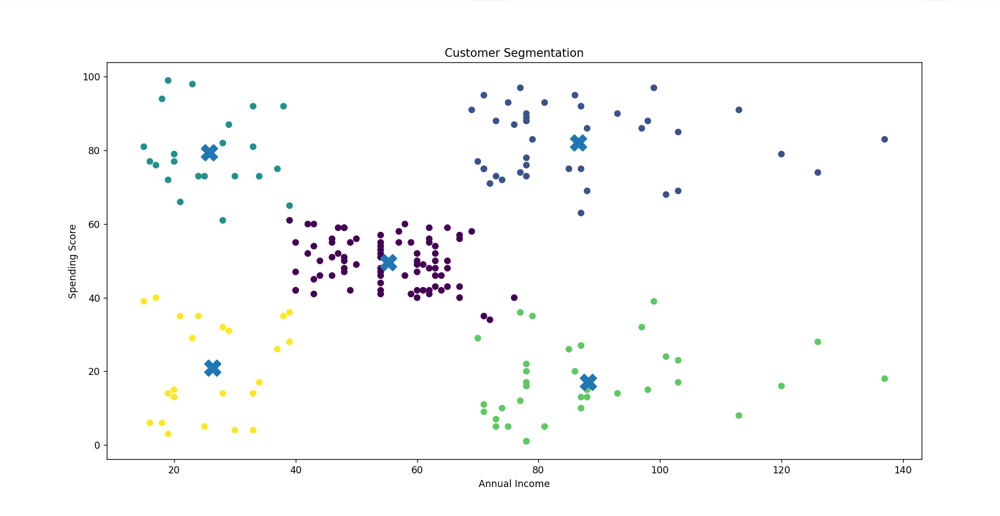
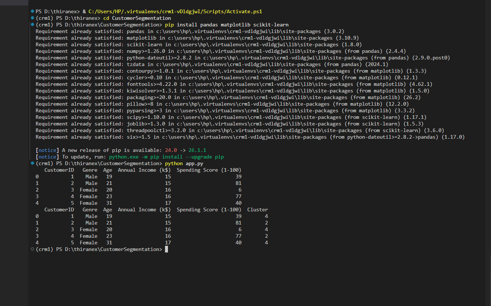

# Customer Segmentation Project

## Objective
This project segments customers based on their annual income and spending behavior using K-Means clustering.

---

## Tools & Technologies Used
- Python
- pandas
- matplotlib
- scikit-learn
- VS Code

---

## Dataset
The project uses the Mall Customers dataset from Kaggle.

Dataset Features:
- Customer ID
- Gender
- Age
- Annual Income
- Spending Score

---

## Project Workflow

1. Load customer dataset
2. Perform data analysis
3. Select important features
4. Apply Elbow Method
5. Train K-Means clustering model
6. Visualize customer segments

---

## Machine Learning Algorithm

### K-Means Clustering
K-Means groups customers with similar behavior into clusters.

The algorithm minimizes the distance between data points and cluster centers.

\[
f(x,y)=\sum_{i=1}^{k}\sum_{x_j \in C_i} ||x_j-\mu_i||^2
\]

---

## Features
- Customer segmentation
- Elbow Method visualization
- Cluster visualization
- Machine learning implementation
- Data analysis using Python

---

## Project Structure

```plaintext
CustomerSegmentation/
│
├── app.py
├── Mall_Customers.csv
├── README.md
├── elbow_graph.png
├── segmentation_graph.png
└── terminal_page.png
```

---

## Installation

Install required libraries:

```bash
pip install pandas matplotlib scikit-learn
```

---

## Run the Project

```bash
python app.py
```

---

## Output Screenshots

### Elbow Method Graph


---

### Customer Segmentation Graph


---

### Terminal Output


---

## Results
The project successfully segments customers into different groups based on income and spending patterns. These insights can help businesses improve marketing strategies and customer targeting.

---

## Conclusion
Successfully implemented customer segmentation using K-Means clustering and visualized customer groups using Python and machine learning techniques.
